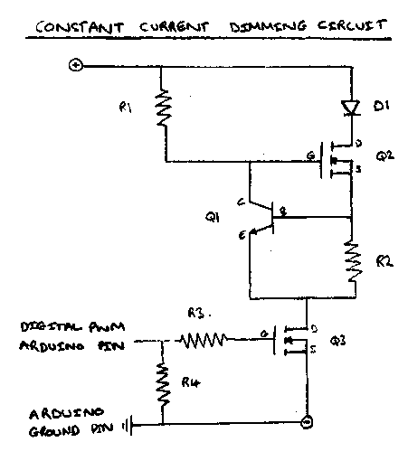
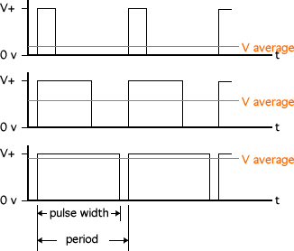
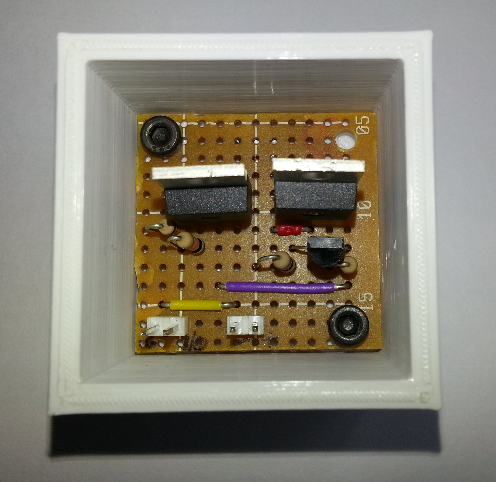
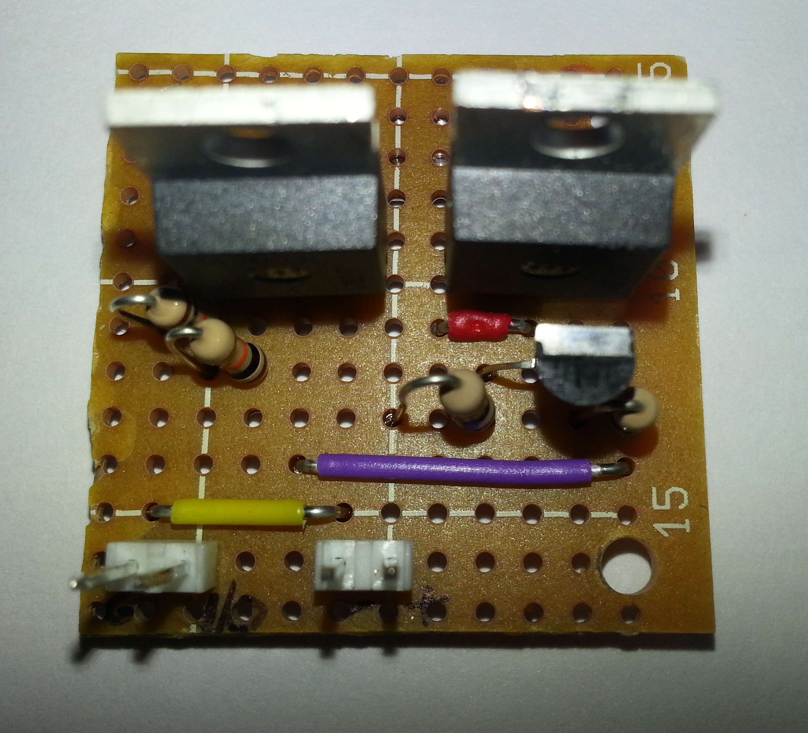
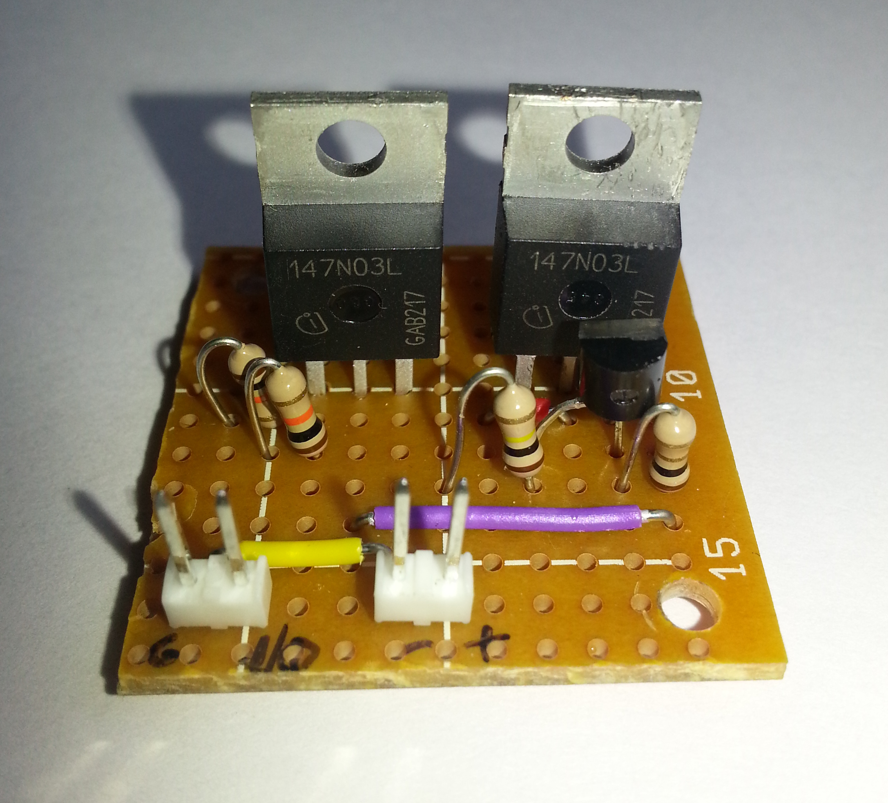
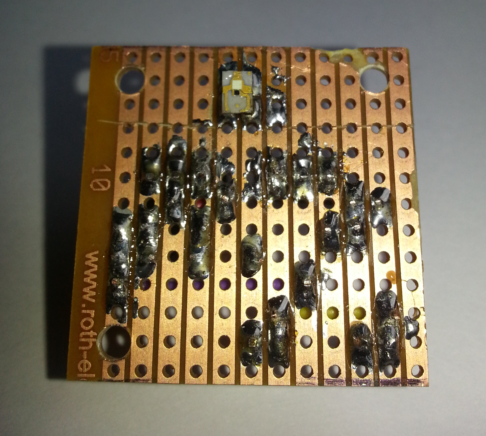

# The Microscope Fluoroscence Module 

## Microscope Attachment

## LED light source for the fluoroscence module

### Introduction
The following set of instructions will provide you with information on creating a constant current LED circuit that can be dimmed by using an Arduino.
There are two main components of the LED light source:

* Constant current circuit. This part of the light source allows the current through the LED to be constant irrespective of the voltage from the power supply used. 
* Dimming circuit. This part of the light source builds upon the constant current circuit, allowing the LED's brightness to be controlled by using an Arduino.

In creating the constant current circuit, Dan Goldwater must be thanked for his tutorial "Power LED's - simplest light with constant-current circuit", which provided the basis for the constant current dimming circuit produced to be used in the fluorscence module of the microscope. The tutorial can be found at [http://www.instructables.com/id/Power-LED-s---simplest-light-with-constant-current/](http://www.instructables.com/id/Power-LED-s---simplest-light-with-constant-current/).
This tutorial provides in depth explanation into how the circuit works and its benefits and hence it is best to visit that tutorial to gain a better understanding of the circuit.

### Circuit Diagram

### Components Required
* Resistors
	- R1: 100K ohm resistor
	- R2: 1.0 ohm resistor
	- R3: 10K ohm resistor
	- R4: 10K ohm resistor
* Transistors
	- Q1: NPN BiPolar BJT (Such as 2N3904 available from [Farnell](http://uk.farnell.com/fairchild-semiconductor/2n3904/transistor-npn-40v-200ma-to-92/dp/9846743))
	- Q2: N-Channel MOSFET (Such as 147N03L available from [Farnell](http://uk.farnell.com/international-rectifier/irlb8721pbf/mosfet-n-ch-30v-62a-to220/dp/1740783?Ntt=147n03l&whydiditmatch=rel_default&matchedProduct=147n03l))
	- Q3: N-Channel MOSFET (Such as 147N03L available from [Farnell](http://uk.farnell.com/international-rectifier/irlb8721pbf/mosfet-n-ch-30v-62a-to220/dp/1740783?Ntt=147n03l&whydiditmatch=rel_default&matchedProduct=147n03l))
* LEDs
	- D1: 450nm blue LED (Such as LUMILEDS LXML-PR01-0425 available from [Farnell](http://uk.farnell.com/lumileds/lxml-pr01-0425/rebel-royal-blue-440nm-460nm/dp/2062928))

A few points about the components:

* R2 is the resistor that determines the current that flows through the circuit. The LED current is set by R2, and is approximately equal to 0.5/R2. For this circuit the LED current was set to 500mA.
* R3 was chosen arbitrarily to limit the current at the Gate pin of Q3, and R4 was chosen to match R3. 
* Q3 can be chosen as any transistor, as this component is used as a switch to control the LED brightness (more information on this will follow), and this was chosen to be the same as Q2 as there were spare N-Channel MOSFET Transistors.
* D1 needed to be a LED with a wavelength of 450nm in order to successfully excite the two fluorophores this module was being designed for as explained in the earlier sections. Any LED can be chosen as long as its wavelength satisfies the fluorophores excitation wavelength.

### Background
To understand how the constant current circuit part of the lighting unit works, take a look at the tutorial by Dan Goldwater (link is in the introduction). The tutorial provides a comprehensive explanation to how the circuit works and is best to read that to fully understand how the constant current circuit works.

The dimming part of the circuit works in a simple manner. The LED is turned on and off very quickly (so that flickering is not noticeable to the human eye) and the output brightness of the LED is a ratio of the time the LED is turned on to the time it is turned off. This technique described is known as Pulse-Width Modulation (PWM) and is a commonly used to control the power supplied to electrical devices. The diagram below (obtained from [Society of Robots](http://www.societyofrobots.com/schematics_h-bridgedes.shtml)) illustrates how PWM is used to control output voltage. 

### Dimming Circuit - Using an Arduino for Pulse-Width Modulation

Arduino boards come with PWM pins which are a number of the digital pins denoted by the '~' symbol. The PWM pin used in this example was Pin 11 on the Arduino Due. In order to utilise PWM from the Arduino pin, rather than using 

`digitalWrite(pinNumber, HIGH/LOW);` 

in order to set the output voltage of the pin to high or low, we need to utilise

`analogWrite(pinNumber, dutyCycle);`

where an dutyCycle is a value from 0-255 that determines the output voltage by varying the time the pin is set to 'HIGH' and 'LOW'.

The circuit utilises transistor Q3 as a switch to constant current part of the circuit. This means that when Q3's gate pin is set to LOW, there is no current going to the LED, whereas when the gate pin is set to HIGH, current flows in the circuit from the positive terminal of the power supply to the negative terminal of the power supply.
As shown in the circuit diagram the Arduino PWN Pin is used to control the switch (transistor Q3) and turns it on and off rapidly (the Arduino PWM pins have a default frequency of 490Hz). This allows the brightness of the LED to vary depending on the value of the dutyCycle with a dutyCycle of 0 corresponding to the LED being turned off and a dutyCycle of 255 corresponding to the LED being turned on, drawing the maximum current (which is 500mA in this case). 
A key thing to note is that one of the Arduino ground pins MUST be connected to the negative terminal of the power supply in order to have a common ground and complete the circuit. If this is not done, the Arduino will not be able to control the switch and the circuit will not work.

It was interesting to note that PWM could be done on the Arduino without using the analogWrite command by manually controlling the time the digital output pins are set to HIGH and LOW. The code below is a snippet that demonstrates how you can emulate PWM on the Arduino without using the analogWrite command:

	void loop()
	{
		digitalWrite(pin, HIGH);
		delay(70);
		digitalWrite(pin, LOW);
		delay(30);
	}

This sets the output voltage to be 70% and reducing the delay time (which is in milliseconds) increases the frequency of PWM. 

NOTE: The Arduino does not provide power to the LED - the pins cannot deal with the large currents required by high power LEDs. The '+' and '-' on the circuit diagram are the positive and negative terminal of an external power supply. 

### Assembling the circuit
The circuit was soldered onto a piece of strip board that was 12 rows by 13 columns (where each contact strip is considered a row) so it slotted into the housing unit for the circuit as show in the images below. 

The circuit is soldered in such a way that the two different parts (constant current and dimming parts) are separated by the white line running through the 7th hole from the left. To the left of the line we have the dimming part and to the right of the line (and including the line) we have the constant current part. This allows for easy testing of the overall circuit, however, it can be easily redesigned as is required.

The two sets of two pin headers are for the Arduino and the power supply. Looking from left to right, the first two pin header is connected to the Arduino, with the left pin connected to a ground pin and the right pin connected to the PWM output pin. The second two pin header is connected to the power supply with the left pin connected to the negative terminal and the right pin connected to the positive terminal (These are marked quite poorly on the strip board itself).

The diagram below illustrates how the components are positioned on the strip board:

A few points to note:

* The LED is soldered directly onto the strip board and is on the opposite side to the other components.
* To use the top portion of the strip board as a heatsink for the LED (it heats up very quickly when a large current is passed through it), the fourth row of holes from the top (with the edge nearest to LED being the top) is cut (except the fifth and sixth columns, where the LED sits). This means that the top portion can be soldered together and used as a makeshift heat sink. 
* The strip board diagram shows the components (except the LED) shifted one row up. This is intentional and the mistake is in the pictures as the components were accidentally soldered one row down.
